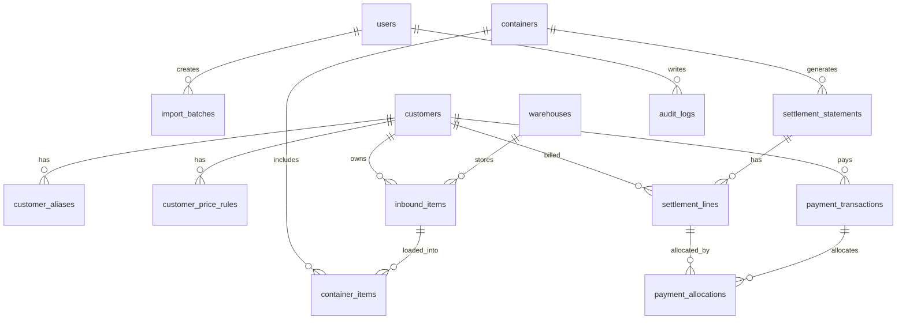

# 璨宇国际仓储与拼柜系统数据库设计（database_design）

## 1. 设计目标与范围
本设计用于支撑“国际仓储 + 拼柜 + 结算 + 报表”的单机系统，满足以下核心目标：
- 支持 Excel 批量导入入库清单，降低手工录入成本。
- 自动计算体积并管理库存状态（在库/已出柜）。
- 支持 68m3 柜容上限的拼柜模拟、确认出柜与撤回。
- 支持定金流水、自动运费分摊扣款、应收应付对账。
- 支持入库单、柜单、账单导出（Excel/PDF）。
- 满足课程实习“需求分析-建模-建库-接口操作-Web展示”的完整流程。

## 2. 需求整合（客户需求 + 开发要求）

### 2.1 客户业务需求拆解
- 系统基础：
  - 单机部署。
  - 管理员账号与密码修改。
  - 自动备份，避免硬件故障导致数据丢失。
- 基础资料：
  - 客户档案（姓名/电话/国家/邮箱）。
  - 支持客户别名（同一客户多个姓名/拼写），并可后续导入别名对照表统一映射。
  - 默认价格（示例：6100元/68m3）+ 柜次临时调价。
- 入库管理：
  - Excel 多模板导入。
  - 自动计算体积：`长*宽*高/1,000,000`（cm 转 m3）。
  - 默认状态“在库”，支持按日期查询、修改、删除。
- 拼柜：
  - 从“未出柜货物”挑货。
  - 柜号管理、68m3 实时占用提示。
  - 支持手工修正装柜占用体积（不规则形状/空隙）。
  - 确认出柜后批量改状态为“已出柜”。
  - 柜次撤销后恢复“在库”。
- 费用：
  - 定金流水（金额+渠道）。
  - 按客户占柜体积 * 客户单价 自动计算运费。
  - 自动抵扣定金，输出余额/欠款。
  - 柜次账单按客户导出 Excel/PDF。
- 报表：
  - 按日入库。
  - 当前在库库存。
  - 客户总账（累计充值、累计消费、余额/欠款）。
  - 所有清单可导出 Excel。

### 2.2 开发实习需求映射
- 步骤一（业务需求罗列）：由本节完成。
- 步骤二（数据库设计+ER）：见第 5、6 节。
- 步骤三（创建数据库+样例数据）：见第 7 节 SQL。
- 步骤四（数据库操作 SQL + PyMySQL/PySQLite CRUD）：见第 8 节。
- 步骤五（Web 页面开发）：见第 9 节开发流程与页面清单。

## 3. 原始数据采样结论（来自 `2025data`）

### 3.1 数据规模与类型（抽样统计）
- 文件总体现状：Excel 为主，辅以 PDF、图片。
- 扩展名计数（目录扫描）：
  - `.xlsx`: 1362
  - `.xls`: 356
  - `.pdf`: 30
  - `.jpg/.png`: 67
- 业务文件按目录与命名可分为：
  - 收货清单（入库）
  - 装柜清单（拼柜/出柜）
  - 客户请款单/Invoice（费用对账）

### 3.2 收货清单模板特征（662 份抽样分析）
- 主模板字段高度一致：`CUSTOMER NAME, SHOP NO, 位置/TEL, ITEM NO, 品名, 材质, CTNS, QTY, PRICE, T.PRICE, 定金, CBM`。
- 存在格式差异：
  - 表头前插入日期或流水号（如 `45426`）。
  - `位置` 与 `TEL` 互换。
  - 部分行客户名为空（表示续行，继承上一行客户）。
  - 同一客户存在多种命名写法（英文大小写、空格、缩写或历史别名）。
- 关键结论：必须使用“模板识别 + 字段映射 + 续行补全”的导入策略。

### 3.3 装柜清单模板特征（787 份抽样分析）
- 常见汇总行字段：`PHONE NUMER, NAME, CBM, CTN, FREIGHT`。
- 明细区经常复用收货列：`SHOP NO, TEL, ITEM NO, 品名, 材质, CTNS, QTY...`。
- 存在强非结构化情况：同一 sheet 同时出现柜号、客户汇总、货物明细、备注。
- 关键结论：装柜 Excel 适合作“导入辅助/对账参考”，系统内应以关系库主数据为准。

### 3.4 请款单/Invoice 特征
- 关键字段：`业务编号、开航日期、柜型、提单号、箱封号、费用名称、人民币、美元`。
- 可作为运费成本侧凭据（非客户入库明细来源）。

## 4. 总体架构
- 本期建议：`Python + SQLite` 单机部署。
- 架构分层：
  - 数据层：SQLite（事务 + 外键）
  - 领域层：服务层封装业务规则（体积、拼柜、结算）
  - 接口层：Flask/FastAPI（本地 Web）
  - 导入导出层：Pandas/OpenPyXL/XLRD + ReportLab
  - 备份层：定时热备（`sqlite .backup` + 压缩 + 保留策略）

## 5. 概念模型（ER）



## 6. 关系模型设计（核心表）

### 6.1 用户与权限

#### `users`
- `id` INTEGER PK
- `username` TEXT UNIQUE NOT NULL
- `password_hash` TEXT NOT NULL
- `role` TEXT NOT NULL CHECK(role IN ('admin','operator','viewer'))
- `is_active` INTEGER NOT NULL DEFAULT 1
- `created_at` DATETIME NOT NULL
- `updated_at` DATETIME NOT NULL

#### `audit_logs`
- `id` INTEGER PK
- `user_id` INTEGER NOT NULL FK -> users.id
- `entity_type` TEXT NOT NULL
- `entity_id` TEXT NOT NULL
- `action` TEXT NOT NULL  -- create/update/delete/confirm/revoke/import/export/login
- `before_json` TEXT
- `after_json` TEXT
- `created_at` DATETIME NOT NULL

### 6.2 主数据

#### `customers`
- `id` INTEGER PK
- `customer_code` TEXT UNIQUE NOT NULL
- `name` TEXT NOT NULL
- `phone` TEXT
- `country` TEXT
- `email` TEXT
- `default_price_per_m3` DECIMAL(10,2) NOT NULL DEFAULT 89.71
- `is_active` INTEGER NOT NULL DEFAULT 1
- `created_at` DATETIME NOT NULL
- `updated_at` DATETIME NOT NULL

#### `customer_aliases`
- `id` INTEGER PK
- `customer_id` INTEGER NOT NULL FK -> customers.id
- `alias_name` TEXT NOT NULL
- `alias_name_norm` TEXT NOT NULL  -- 标准化后名称（去空格/大写等）
- `source` TEXT NOT NULL DEFAULT 'MANUAL' CHECK(source IN ('MANUAL','IMPORT_MAP','AUTO_DETECT'))
- `is_primary` INTEGER NOT NULL DEFAULT 0
- `is_active` INTEGER NOT NULL DEFAULT 1
- `remark` TEXT
- `created_at` DATETIME NOT NULL
- `updated_at` DATETIME NOT NULL
- UNIQUE(alias_name_norm)

#### `warehouses`
- `id` INTEGER PK
- `name` TEXT NOT NULL
- `location` TEXT
- `is_active` INTEGER NOT NULL DEFAULT 1

#### `customer_price_rules`
- `id` INTEGER PK
- `customer_id` INTEGER NOT NULL FK -> customers.id
- `effective_from` DATE NOT NULL
- `effective_to` DATE
- `price_per_m3` DECIMAL(10,2) NOT NULL
- `currency` TEXT NOT NULL DEFAULT 'CNY'
- `remark` TEXT
- UNIQUE(customer_id, effective_from)

### 6.3 入库域

#### `import_batches`
- `id` INTEGER PK
- `batch_no` TEXT UNIQUE NOT NULL
- `source_file` TEXT NOT NULL
- `sheet_name` TEXT
- `import_type` TEXT NOT NULL CHECK(import_type IN ('inbound','container','invoice'))
- `total_rows` INTEGER NOT NULL DEFAULT 0
- `success_rows` INTEGER NOT NULL DEFAULT 0
- `failed_rows` INTEGER NOT NULL DEFAULT 0
- `error_report_path` TEXT
- `created_by` INTEGER NOT NULL FK -> users.id
- `created_at` DATETIME NOT NULL

#### `inbound_items`
- `id` INTEGER PK
- `inbound_no` TEXT UNIQUE NOT NULL
- `import_batch_id` INTEGER FK -> import_batches.id
- `customer_id` INTEGER NOT NULL FK -> customers.id
- `warehouse_id` INTEGER NOT NULL FK -> warehouses.id
- `inbound_date` DATE NOT NULL
- `shop_no` TEXT
- `position_or_tel` TEXT
- `item_no` TEXT
- `item_name_cn` TEXT
- `material` TEXT
- `carton_count` INTEGER
- `qty` INTEGER
- `unit_price` DECIMAL(10,2)
- `total_price` DECIMAL(12,2)
- `deposit_hint` DECIMAL(12,2)
- `length_cm` DECIMAL(10,2)
- `width_cm` DECIMAL(10,2)
- `height_cm` DECIMAL(10,2)
- `cbm_calculated` DECIMAL(12,6) NOT NULL DEFAULT 0
- `cbm_override` DECIMAL(12,6)
- `cbm_final` DECIMAL(12,6) GENERATED ALWAYS AS (COALESCE(cbm_override, cbm_calculated)) VIRTUAL
- `status` TEXT NOT NULL DEFAULT 'IN_STOCK' CHECK(status IN ('IN_STOCK','ALLOCATED','SHIPPED'))
- `container_id` INTEGER FK -> containers.id
- `remark` TEXT
- `created_at` DATETIME NOT NULL
- `updated_at` DATETIME NOT NULL

说明：
- 若导入文件已给 CBM，则写 `cbm_calculated`，并可由规则复算校验。
- 若用户人工调整占用体积（装柜时），写 `cbm_override`，实际计费/占柜用 `cbm_final`。

### 6.4 拼柜域

#### `containers`
- `id` INTEGER PK
- `container_no` TEXT UNIQUE NOT NULL  -- 例如 CAB-20260319-01
- `container_type` TEXT NOT NULL DEFAULT '40HQ'
- `capacity_cbm` DECIMAL(10,3) NOT NULL DEFAULT 68.000
- `eta_date` DATE
- `status` TEXT NOT NULL CHECK(status IN ('DRAFT','CONFIRMED','REVOKED'))
- `price_mode` TEXT NOT NULL DEFAULT 'BY_CUSTOMER_RULE' CHECK(price_mode IN ('BY_CUSTOMER_RULE','BY_CONTAINER_DEFAULT'))
- `default_price_per_m3` DECIMAL(10,2)
- `confirmed_at` DATETIME
- `revoked_at` DATETIME
- `remark` TEXT
- `created_by` INTEGER NOT NULL FK -> users.id
- `created_at` DATETIME NOT NULL
- `updated_at` DATETIME NOT NULL

#### `container_items`
- `id` INTEGER PK
- `container_id` INTEGER NOT NULL FK -> containers.id
- `inbound_item_id` INTEGER NOT NULL FK -> inbound_items.id
- `cbm_at_load` DECIMAL(12,6) NOT NULL
- `load_order` INTEGER
- `remark` TEXT
- `created_at` DATETIME NOT NULL
- UNIQUE(container_id, inbound_item_id)

约束：
- 业务约束（应用层 + 触发器可选）：
  - `SUM(container_items.cbm_at_load) <= containers.capacity_cbm`。
  - 柜状态 `CONFIRMED` 后禁止增删装柜明细。

### 6.5 结算域

#### `payment_transactions`
- `id` INTEGER PK
- `payment_no` TEXT UNIQUE NOT NULL
- `customer_id` INTEGER NOT NULL FK -> customers.id
- `payment_date` DATE NOT NULL
- `amount` DECIMAL(12,2) NOT NULL
- `currency` TEXT NOT NULL DEFAULT 'CNY'
- `method` TEXT NOT NULL  -- WECHAT/ALIPAY/BANK/CASH
- `reference_no` TEXT
- `remark` TEXT
- `created_by` INTEGER NOT NULL FK -> users.id
- `created_at` DATETIME NOT NULL

#### `settlement_statements`
- `id` INTEGER PK
- `statement_no` TEXT UNIQUE NOT NULL
- `container_id` INTEGER NOT NULL FK -> containers.id
- `statement_date` DATE NOT NULL
- `status` TEXT NOT NULL CHECK(status IN ('DRAFT','POSTED','VOID'))
- `currency` TEXT NOT NULL DEFAULT 'CNY'
- `created_by` INTEGER NOT NULL FK -> users.id
- `created_at` DATETIME NOT NULL
- `updated_at` DATETIME NOT NULL

#### `settlement_lines`
- `id` INTEGER PK
- `statement_id` INTEGER NOT NULL FK -> settlement_statements.id
- `customer_id` INTEGER NOT NULL FK -> customers.id
- `cbm_total` DECIMAL(12,6) NOT NULL
- `price_per_m3` DECIMAL(10,2) NOT NULL
- `freight_amount` DECIMAL(12,2) NOT NULL
- `deposit_used` DECIMAL(12,2) NOT NULL DEFAULT 0
- `amount_due` DECIMAL(12,2) NOT NULL DEFAULT 0
- `amount_balance` DECIMAL(12,2) NOT NULL DEFAULT 0
- `remark` TEXT
- UNIQUE(statement_id, customer_id)

#### `payment_allocations`
- `id` INTEGER PK
- `payment_id` INTEGER NOT NULL FK -> payment_transactions.id
- `settlement_line_id` INTEGER NOT NULL FK -> settlement_lines.id
- `allocated_amount` DECIMAL(12,2) NOT NULL
- `created_at` DATETIME NOT NULL

### 6.6 导出与备份

#### `export_jobs`
- `id` INTEGER PK
- `export_type` TEXT NOT NULL CHECK(export_type IN ('INBOUND_DAILY','INVENTORY','CONTAINER','STATEMENT','LEDGER'))
- `filter_json` TEXT
- `file_path` TEXT NOT NULL
- `created_by` INTEGER NOT NULL FK -> users.id
- `created_at` DATETIME NOT NULL

#### `backup_jobs`
- `id` INTEGER PK
- `backup_time` DATETIME NOT NULL
- `backup_file` TEXT NOT NULL
- `size_bytes` INTEGER
- `status` TEXT NOT NULL CHECK(status IN ('SUCCESS','FAILED'))
- `message` TEXT

## 7. 建库 SQL（SQLite 方言，核心片段）

```sql
PRAGMA foreign_keys = ON;

CREATE TABLE users (
  id INTEGER PRIMARY KEY,
  username TEXT NOT NULL UNIQUE,
  password_hash TEXT NOT NULL,
  role TEXT NOT NULL CHECK(role IN ('admin','operator','viewer')),
  is_active INTEGER NOT NULL DEFAULT 1,
  created_at TEXT NOT NULL,
  updated_at TEXT NOT NULL
);

CREATE TABLE customers (
  id INTEGER PRIMARY KEY,
  customer_code TEXT NOT NULL UNIQUE,
  name TEXT NOT NULL,
  phone TEXT,
  country TEXT,
  email TEXT,
  default_price_per_m3 NUMERIC NOT NULL DEFAULT 89.71,
  is_active INTEGER NOT NULL DEFAULT 1,
  created_at TEXT NOT NULL,
  updated_at TEXT NOT NULL
);

CREATE TABLE customer_aliases (
  id INTEGER PRIMARY KEY,
  customer_id INTEGER NOT NULL,
  alias_name TEXT NOT NULL,
  alias_name_norm TEXT NOT NULL UNIQUE,
  source TEXT NOT NULL DEFAULT 'MANUAL' CHECK(source IN ('MANUAL','IMPORT_MAP','AUTO_DETECT')),
  is_primary INTEGER NOT NULL DEFAULT 0,
  is_active INTEGER NOT NULL DEFAULT 1,
  remark TEXT,
  created_at TEXT NOT NULL,
  updated_at TEXT NOT NULL,
  FOREIGN KEY(customer_id) REFERENCES customers(id)
);

CREATE TABLE containers (
  id INTEGER PRIMARY KEY,
  container_no TEXT NOT NULL UNIQUE,
  container_type TEXT NOT NULL DEFAULT '40HQ',
  capacity_cbm NUMERIC NOT NULL DEFAULT 68.0,
  status TEXT NOT NULL CHECK(status IN ('DRAFT','CONFIRMED','REVOKED')),
  price_mode TEXT NOT NULL DEFAULT 'BY_CUSTOMER_RULE' CHECK(price_mode IN ('BY_CUSTOMER_RULE','BY_CONTAINER_DEFAULT')),
  default_price_per_m3 NUMERIC,
  confirmed_at TEXT,
  revoked_at TEXT,
  remark TEXT,
  created_by INTEGER NOT NULL,
  created_at TEXT NOT NULL,
  updated_at TEXT NOT NULL,
  FOREIGN KEY(created_by) REFERENCES users(id)
);

CREATE TABLE inbound_items (
  id INTEGER PRIMARY KEY,
  inbound_no TEXT NOT NULL UNIQUE,
  customer_id INTEGER NOT NULL,
  inbound_date TEXT NOT NULL,
  shop_no TEXT,
  position_or_tel TEXT,
  item_no TEXT,
  item_name_cn TEXT,
  material TEXT,
  carton_count INTEGER,
  qty INTEGER,
  unit_price NUMERIC,
  total_price NUMERIC,
  length_cm NUMERIC,
  width_cm NUMERIC,
  height_cm NUMERIC,
  cbm_calculated NUMERIC NOT NULL DEFAULT 0,
  cbm_override NUMERIC,
  status TEXT NOT NULL DEFAULT 'IN_STOCK' CHECK(status IN ('IN_STOCK','ALLOCATED','SHIPPED')),
  container_id INTEGER,
  created_at TEXT NOT NULL,
  updated_at TEXT NOT NULL,
  FOREIGN KEY(customer_id) REFERENCES customers(id),
  FOREIGN KEY(container_id) REFERENCES containers(id)
);

CREATE INDEX idx_inbound_status_date ON inbound_items(status, inbound_date);
CREATE INDEX idx_inbound_customer ON inbound_items(customer_id);
CREATE INDEX idx_customer_aliases_customer ON customer_aliases(customer_id);
CREATE INDEX idx_container_items_container ON container_items(container_id);
```

## 8. 典型业务 SQL（>=10 条，含增删改查）

1. 新增客户
```sql
INSERT INTO customers(customer_code, name, phone, country, email, default_price_per_m3, created_at, updated_at)
VALUES ('CUST-0001', 'MARTIN', '0800000000', 'Nigeria', 'm@example.com', 89.71, datetime('now'), datetime('now'));
```

2. 修改客户单价
```sql
UPDATE customers SET default_price_per_m3 = 95.00, updated_at = datetime('now') WHERE id = ?;
```

3. 新增客户别名（用于导入映射）
```sql
INSERT INTO customer_aliases(customer_id, alias_name, alias_name_norm, source, created_at, updated_at)
VALUES (?, ?, ?, 'IMPORT_MAP', datetime('now'), datetime('now'))
ON CONFLICT(alias_name_norm) DO UPDATE SET
  customer_id=excluded.customer_id,
  alias_name=excluded.alias_name,
  source='IMPORT_MAP',
  updated_at=datetime('now');
```

4. Excel 导入后写入入库记录（示例）
```sql
INSERT INTO inbound_items(inbound_no, customer_id, inbound_date, shop_no, item_no, item_name_cn, carton_count, qty, cbm_calculated, status, created_at, updated_at)
VALUES (?, ?, ?, ?, ?, ?, ?, ?, ?, 'IN_STOCK', datetime('now'), datetime('now'));
```

5. 查询某日入库清单
```sql
SELECT i.inbound_no, c.name, i.item_name_cn, i.carton_count, i.qty, i.cbm_calculated
FROM inbound_items i
JOIN customers c ON c.id = i.customer_id
WHERE i.inbound_date = '2026-03-19'
ORDER BY c.name, i.id;
```

6. 查询当前在库库存
```sql
SELECT i.inbound_no, c.name, i.item_name_cn, COALESCE(i.cbm_override, i.cbm_calculated) AS cbm_final
FROM inbound_items i
JOIN customers c ON c.id = i.customer_id
WHERE i.status = 'IN_STOCK'
ORDER BY i.inbound_date DESC;
```

7. 创建柜次
```sql
INSERT INTO containers(container_no, capacity_cbm, status, created_by, created_at, updated_at)
VALUES ('CAB-20260319-01', 68.0, 'DRAFT', 1, datetime('now'), datetime('now'));
```

8. 装柜前容量检查
```sql
SELECT c.capacity_cbm,
       COALESCE(SUM(ci.cbm_at_load),0) AS used_cbm,
       c.capacity_cbm - COALESCE(SUM(ci.cbm_at_load),0) AS remain_cbm
FROM containers c
LEFT JOIN container_items ci ON ci.container_id = c.id
WHERE c.id = ?
GROUP BY c.id;
```

9. 确认出柜（事务）
```sql
BEGIN;
UPDATE containers SET status='CONFIRMED', confirmed_at=datetime('now'), updated_at=datetime('now') WHERE id=? AND status='DRAFT';
UPDATE inbound_items
SET status='SHIPPED', container_id=? , updated_at=datetime('now')
WHERE id IN (SELECT inbound_item_id FROM container_items WHERE container_id=?);
COMMIT;
```

10. 撤回柜次（事务）
```sql
BEGIN;
UPDATE containers SET status='REVOKED', revoked_at=datetime('now'), updated_at=datetime('now') WHERE id=? AND status='CONFIRMED';
UPDATE inbound_items SET status='IN_STOCK', container_id=NULL, updated_at=datetime('now') WHERE container_id=?;
COMMIT;
```

11. 生成客户账单行（按客户聚合）
```sql
INSERT INTO settlement_lines(statement_id, customer_id, cbm_total, price_per_m3, freight_amount, amount_due, amount_balance)
SELECT :statement_id,
       i.customer_id,
       SUM(ci.cbm_at_load) AS cbm_total,
       COALESCE(cr.price_per_m3, cu.default_price_per_m3) AS price_per_m3,
       ROUND(SUM(ci.cbm_at_load) * COALESCE(cr.price_per_m3, cu.default_price_per_m3), 2) AS freight_amount,
       ROUND(SUM(ci.cbm_at_load) * COALESCE(cr.price_per_m3, cu.default_price_per_m3), 2) AS amount_due,
       0
FROM container_items ci
JOIN inbound_items i ON i.id = ci.inbound_item_id
JOIN customers cu ON cu.id = i.customer_id
LEFT JOIN customer_price_rules cr ON cr.customer_id = cu.id AND date('now') BETWEEN cr.effective_from AND COALESCE(cr.effective_to, '2999-12-31')
WHERE ci.container_id = :container_id
GROUP BY i.customer_id;
```

12. 查询客户总账
```sql
SELECT c.name,
       COALESCE(SUM(p.amount),0) AS total_deposit,
       COALESCE(SUM(sl.freight_amount),0) AS total_freight,
       COALESCE(SUM(p.amount),0) - COALESCE(SUM(sl.freight_amount),0) AS net_balance
FROM customers c
LEFT JOIN payment_transactions p ON p.customer_id = c.id
LEFT JOIN settlement_lines sl ON sl.customer_id = c.id
GROUP BY c.id
ORDER BY c.name;
```

13. 删除误录入库（仅在库可删）
```sql
DELETE FROM inbound_items WHERE id=? AND status='IN_STOCK';
```

## 9. 技术栈与开发流程

### 9.1 技术栈（单机优先）
- 语言：Python 3.12
- 数据库：SQLite 3（首期）
- ORM/迁移：SQLAlchemy + Alembic
- 数据处理：Pandas + OpenPyXL + XLRD
- Web：Flask + Jinja2（或 FastAPI + HTMX）
- 报表导出：OpenPyXL（Excel）+ ReportLab（PDF）
- 认证安全：Passlib(Bcrypt) + 本地会话
- 任务调度：APScheduler（自动备份）
- 测试：Pytest
- 打包：PyInstaller（桌面单机发布）

### 9.2 开发流程（与课程五步对齐）
1. 需求冻结：按本设计文档逐条验收口径。  
2. 建模与建库：按第 6、7 节落地 DDL + 初始化数据。  
3. 数据导入脚本：实现“模板识别、字段映射、错误行回写”。  
4. 业务服务：实现入库、拼柜、确认/撤回、结算、导出。  
5. Web 页面：
   - 登录/改密
   - 客户管理+价格设置
   - 入库导入与在库列表
   - 拼柜模拟页（容量进度条）
   - 结算页与客户总账
   - 报表导出页
6. 测试验收：功能测试 + 回归 + 样本文件导入测试。  
7. 版本管理：每次提交写清 commit message，并维护 `agent/update_log.md`。  

### 9.3 环境约束（WSL 开发 -> Windows 运行）
- 当前开发环境为 WSL，目标运行环境为 Windows（单机）。
- 代码约束：
  - 统一使用 `pathlib` 处理路径，避免硬编码 `/` 或 `\\`。
  - 文件读写统一 `UTF-8`，导出 Excel/PDF 时显式处理中文文件名。
  - 依赖选择优先跨平台库，避免仅 Linux 可用的系统调用。
- 发布约束：
  - 提供 Windows 启动脚本（`.bat`）与配置模板（`.env.example`）。
  - 使用 PyInstaller 在 Windows 打包验证一次（含 SQLite、模板、静态资源）。
  - 备份目录默认放在 Windows 用户目录下可写路径（如 `%APPDATA%` 或 `%USERPROFILE%` 子目录）。

## 10. 可扩展性分析

### 10.1 数据规模扩展
- 现状估算：每年数万级货物明细，SQLite 可支撑单机业务。
- 索引策略：
  - `inbound_items(status, inbound_date)`
  - `inbound_items(customer_id)`
  - `container_items(container_id)`
  - `settlement_lines(customer_id)`
- 历史归档：按年份归档导出，降低主库膨胀。

### 10.2 业务扩展
- 多仓：`warehouses` 已预留。
- 多币种：结算表含 `currency`，可扩展汇率表。
- 海运成本联动：可新增 `shipping_costs` 对接请款单。
- 审批流：可新增 `workflow_tasks` 支持“复核后出柜”。

### 10.3 架构扩展路径
- 单机 -> 局域网：SQLite 替换为 MySQL/PostgreSQL。
- 应用层基本无感迁移：依赖 ORM 和 migration。
- 报表重负载可外移到异步任务/只读副本。

### 10.4 风险与控制
- 导入脏数据：导入前校验 + 错误报告 + 审核确认。
- 数据丢失：每日自动备份 + 启动时最近备份健康检查。
- 并发冲突：关键流程（确认出柜/撤回/结算）全部事务化。
- 容量超载：装柜写入前二次校验，防止超 68m3。

## 11. 验收清单（逐条对照客户需求）
- [x] 单机运行 + 自动备份
- [x] 管理员账号、改密
- [x] 客户档案与默认价格、临时调价
- [x] Excel 批量导入入库
- [x] 自动体积计算与在库状态管理
- [x] 拼柜模拟、容量实时提示、手工修正占用
- [x] 确认出柜/撤回
- [x] 定金流水、自动运费与扣款
- [x] 柜单/账单导出 Excel/PDF
- [x] 日入库、在库、客户总账报表
- [x] 满足实习要求：需求、ER、建库、SQL、接口、Web

---

本文件为数据库与系统实现的基线设计。下一步即可进入：
1) `schema.sql + Alembic` 建库；
2) `importer` 脚本开发；
3) Web 页面最小可用版本（MVP）开发。
